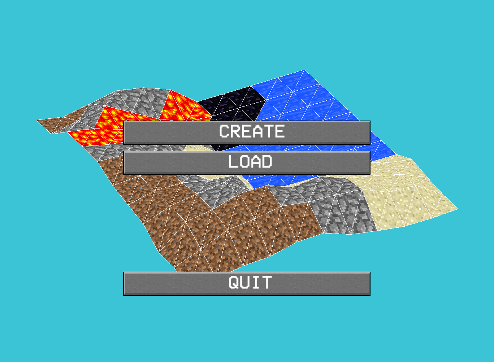
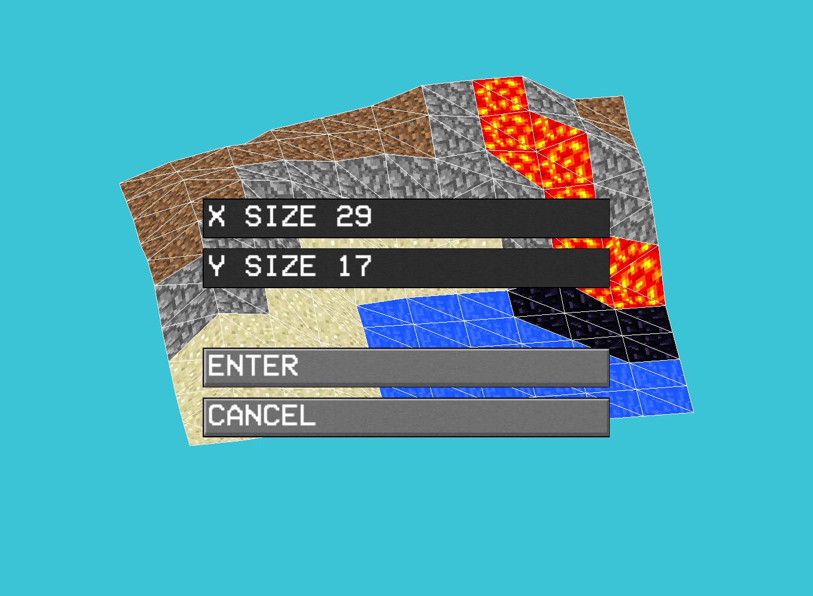
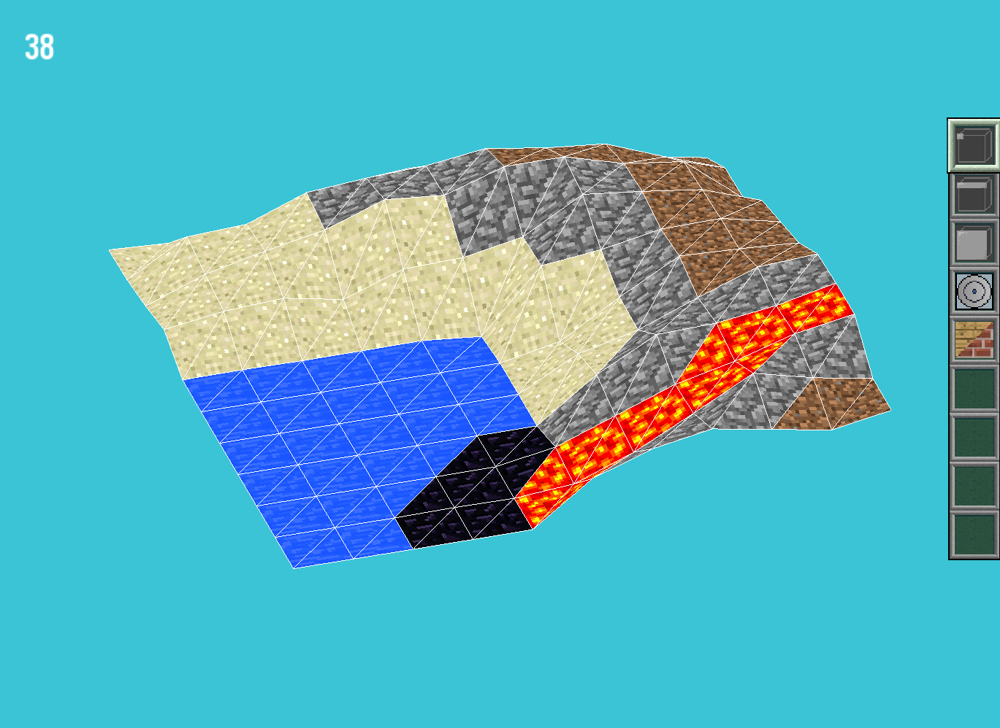

# My World

This project was made midway through my first year in computer science. It is a teraforming engine that allows the user to modify the mesh of a 3D world using a variety of tools. It can also load objects from .obj files and render them in the world. The engine is implemented in C with CSFML **without the standard library and other external libraries**.

## Features
- 3D rendering
- 3D mesh modification
- Texture modification
- Object loading
- Object manipulation
- Map saving and loading

## Compilation
To compile the project just run the following command:

```
make
```
This will create a binary named "my_world" at the root of the repository.

## Usage
Launch the program by simply executing the binary

```
./my_world
```
The program can also be launched with an argument that will unlock a secret feature


## Navigation
Once the program is running, you can navigate through the 3D rendering using the mouse and keyboard controls. Use the following keys for navigation:

- **Mouse**: The mouse can be used to make modifications to the world. The left click button can be used decrease the height of the terrain and the right click button can be used to increase the height of the terrain. The mouse wheel can be used to zoom in and out of the world.
- **Arrow Keys**: The arrow keys can be used to move the map around.
- **Key A**: The A key can be used to pause the game.
- **Key P**: The P key can be used to toggle the editor menu.

## Images




